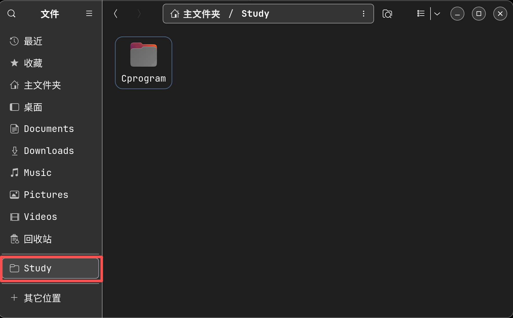
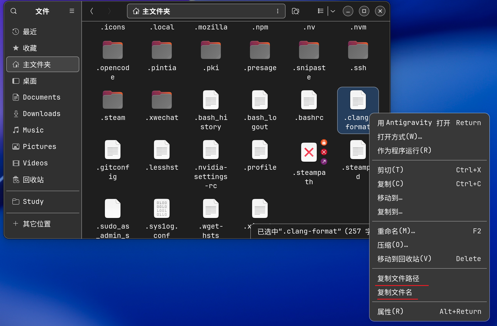
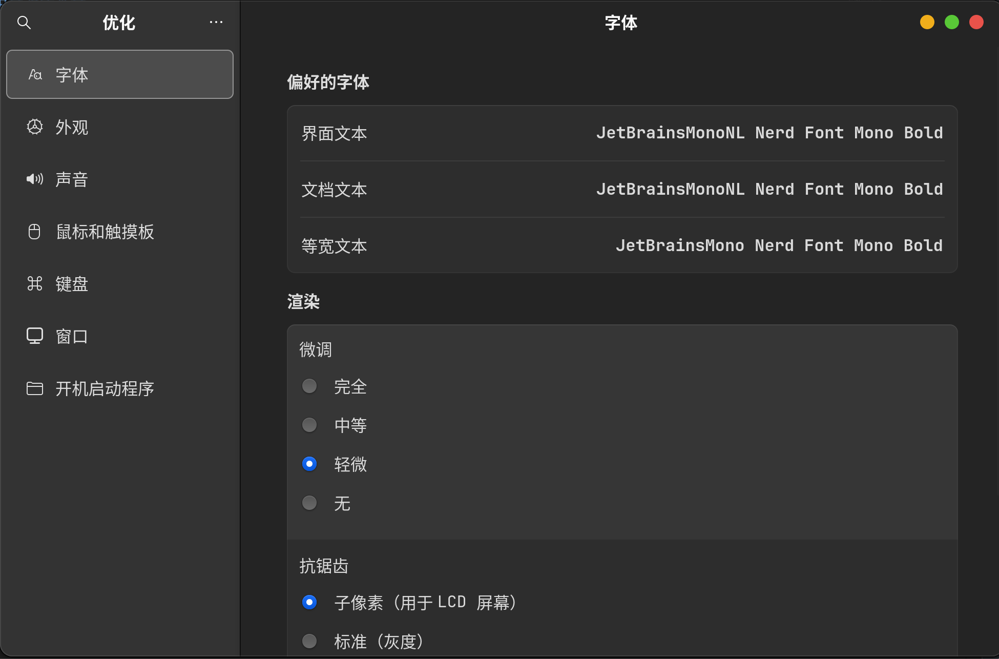
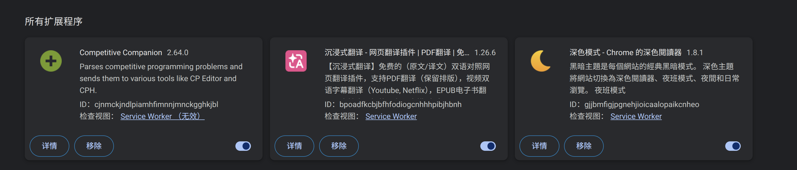
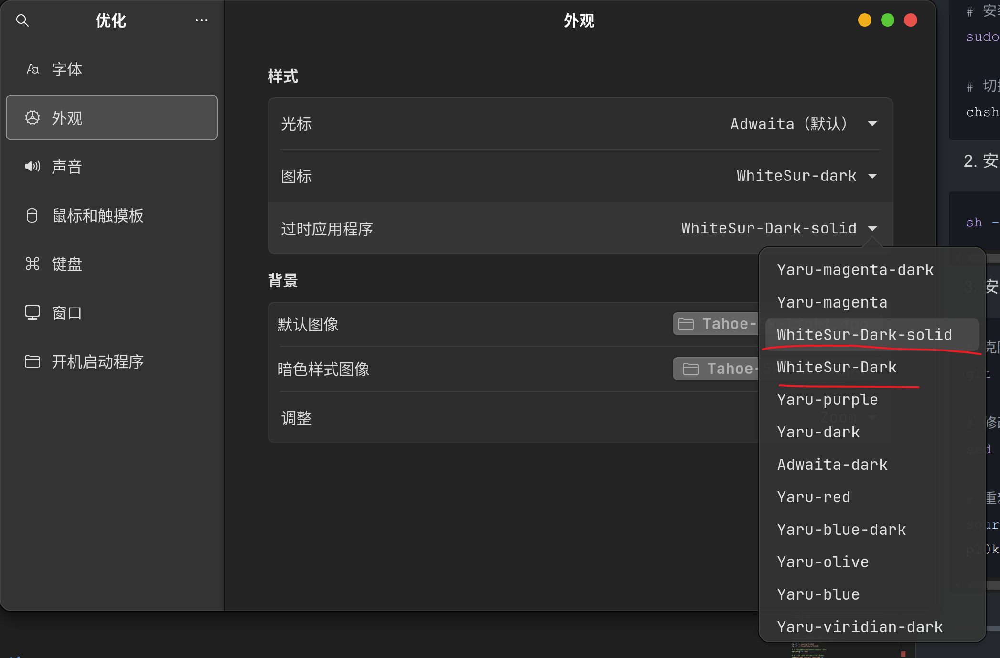
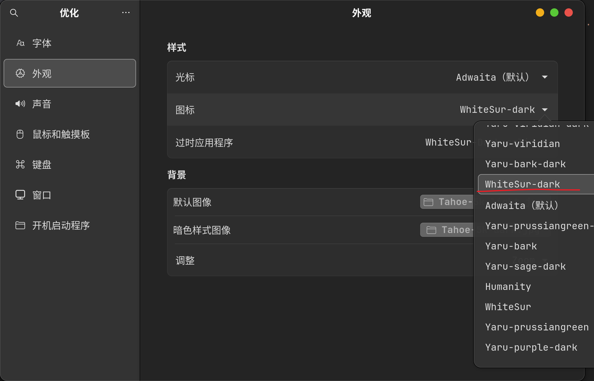
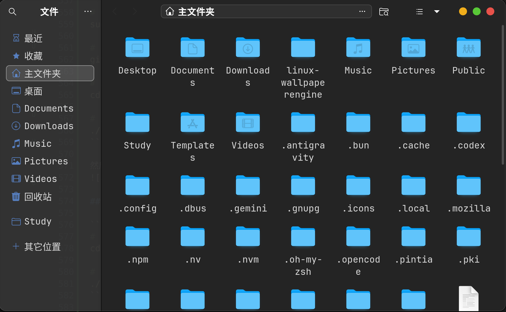
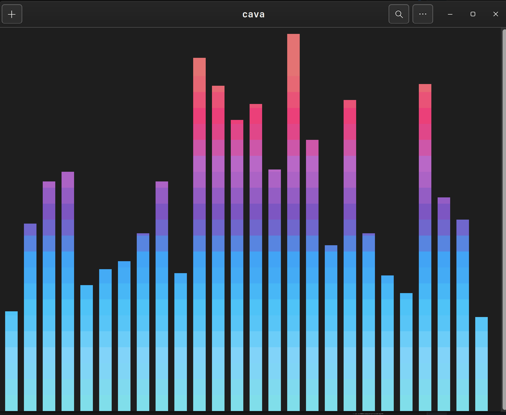
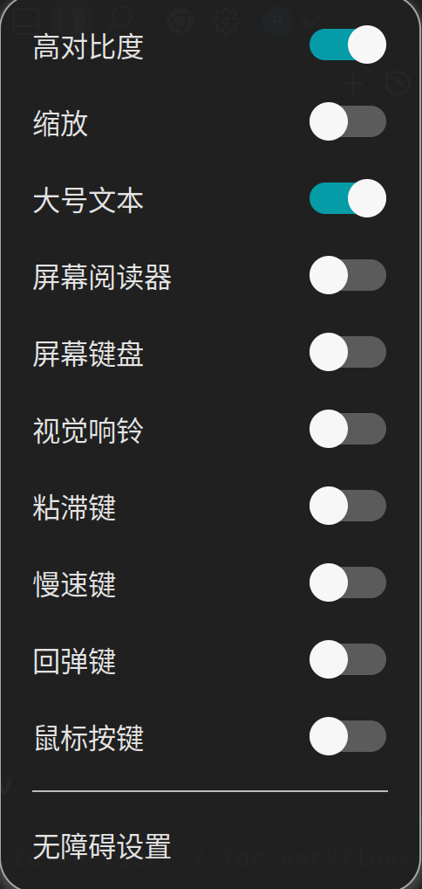
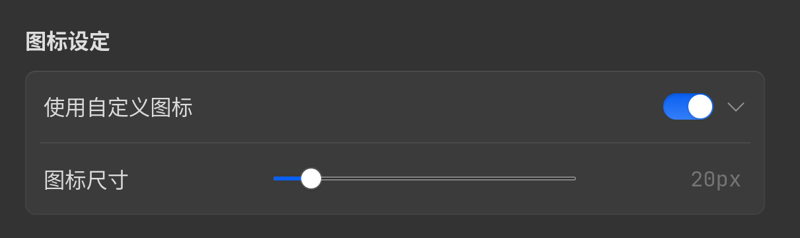

<div align="center">

# 折腾指南

</div>

## 目录

- [折腾指南](#折腾指南)
  - [目录](#目录)
  - [把日常用的文件夹放在一个书签里面](#把日常用的文件夹放在一个书签里面)
  - [修复开机后终端/文件管理器打不开的问题（如果用了fcitx5）](#修复开机后终端文件管理器打不开的问题如果用了fcitx5)
  - [在 Nautilus 右键一级菜单中添加「复制路径」和「复制文件名」](#在-nautilus-右键一级菜单中添加复制路径和复制文件名)
  - [禁用 Super+V 打开通知面板](#禁用-superv-打开通知面板)
  - [合盖行为：插电不休眠，用电池正常休眠](#合盖行为插电不休眠用电池正常休眠)
  - [VS Code C++ 编译运行环境配置（Ubuntu）](#vs-code-c-编译运行环境配置ubuntu)
    - [1. 插件推荐](#1-插件推荐)
    - [2. settings.json 推荐配置](#2-settingsjson-推荐配置)
    - [3. 外部终端设置](#3-外部终端设置)
    - [4. 把用户文件夹从中文改成英文](#4-把用户文件夹从中文改成英文)
    - [5. 安装字体（JetBrainsMono Nerd Font）](#5-安装字体jetbrainsmono-nerd-font)
    - [6. 全局 .clang-format 配置](#6-全局-clang-format-配置)
  - [7. 导出与恢复 GNOME 扩展及其配置](#7-导出与恢复-gnome-扩展及其配置)
    - [备份当前配置](#备份当前配置)
    - [在新环境恢复](#在新环境恢复)
      - [第一步：安装 gext 工具](#第一步安装-gext-工具)
      - [第二步：批量下载扩展](#第二步批量下载扩展)
      - [第三步：启用全部扩展](#第三步启用全部扩展)
      - [第四步：恢复扩展配置](#第四步恢复扩展配置)
  - [8. 配置 GNOME 终端快捷键](#8-配置-gnome-终端快捷键)
  - [彻底卸载 Fcitx5 并为 iBus 安装 Rime](#彻底卸载-fcitx5-并为-ibus-安装-rime)
  - [卸载snap包及其组件](#卸载snap包及其组件)
  - [使 Ubuntu24.04 看起来像 MacOS](#使-ubuntu2404-看起来像-macos)
  - [使 Ubuntu22.04 看起来像 MacOS](#使-ubuntu2204-看起来像-macos)
  - [chrome 安装插件](#chrome-安装插件)
  - [开机动画 (Apple logo)](#开机动画-apple-logo)
  - [终端美化 (Zsh + Powerlevel10k)](#终端美化-zsh--powerlevel10k)
  - [安装 WhiteSur-gtk-theme](#安装-whitesur-gtk-theme)
  - [安装 WhiteSur-icon-theme](#安装-whitesur-icon-theme)
  - [安装 Cava（能让终端随着电脑播放的音乐翩翩起舞）](#安装-cava能让终端随着电脑播放的音乐翩翩起舞)
  - [打开无障碍设置](#打开无障碍设置)
  - [logo Menu 插件设置](#logo-menu-插件设置)
  - [修复 AppMenu is Back 启动问题](#修复-appmenu-is-back-启动问题)

---

## 把日常用的文件夹放在一个书签里面

方法:
* 先双击进入想要添加的那个文件夹。
* 按下键盘上的 Ctrl + D。
* 该文件夹就会立即出现在左侧导航栏的"书签"区域。

---

## 修复开机后终端/文件管理器打不开的问题（如果用了fcitx5）

**原因**：`fcitx5` 在图形会话就绪前过早触发 `xdg-desktop-portal`，导致启动失败，开机后第一次点终端/文件管理器要等很久。

```bash
# 1. 创建 override 目录和配置文件
mkdir -p ~/.config/systemd/user/xdg-desktop-portal.service.d/

cat > ~/.config/systemd/user/xdg-desktop-portal.service.d/override.conf << 'EOF'
[Unit]
After=graphical-session.target
Wants=graphical-session.target
EOF

# 2. 重新加载配置（建议重启）
## systemctl --user daemon-reload
```

**恢复方法**：
```bash
rm -rf ~/.config/systemd/user/xdg-desktop-portal.service.d/
systemctl --user daemon-reload
```

---

## 在 Nautilus 右键一级菜单中添加「复制路径」和「复制文件名」

```bash
# 1. 安装依赖
sudo apt install -y python3-nautilus xclip

# 2. 创建扩展目录
mkdir -p ~/.local/share/nautilus-python/extensions/
```

**文件1**：`~/.local/share/nautilus-python/extensions/copy_absolute_path.py`

```python
import subprocess
from urllib.parse import unquote
from gi.repository import Nautilus, GObject

class CopyPathExtension(GObject.GObject, Nautilus.MenuProvider):
    def _copy_to_clipboard(self, text):
        try:
            process = subprocess.Popen(["xclip", "-selection", "clipboard"], stdin=subprocess.PIPE)
            process.communicate(text.encode("utf-8"))
        except Exception:
            pass

    def _get_path(self, f):
        uri = f.get_uri()
        return unquote(uri[7:]) if uri.startswith("file://") else f.get_name()

    def get_file_items(self, files):
        if not files: return []
        if len(files) == 1:
            label = "复制文件夹路径" if files[0].is_directory() else "复制文件路径"
        else:
            label = f"复制 {len(files)} 个项目的绝对路径"
        item = Nautilus.MenuItem(name="CopyPath::copy_path", label=label)
        item.connect("activate", lambda w: self._copy_to_clipboard("\n".join([self._get_path(f) for f in files])))
        return [item]

    def get_background_items(self, current_folder):
        item = Nautilus.MenuItem(name="CopyPath::copy_bg_path", label="复制当前路径")
        item.connect("activate", lambda w: self._copy_to_clipboard(self._get_path(current_folder)))
        return [item]
```

**文件2**：`~/.local/share/nautilus-python/extensions/copy_item_name.py`

```python
import subprocess
from urllib.parse import unquote
from gi.repository import Nautilus, GObject

class CopyNameExtension(GObject.GObject, Nautilus.MenuProvider):
    def _copy_to_clipboard(self, text):
        try:
            process = subprocess.Popen(["xclip", "-selection", "clipboard"], stdin=subprocess.PIPE)
            process.communicate(text.encode("utf-8"))
        except Exception:
            pass

    def get_file_items(self, files):
        if not files: return []
        if len(files) == 1:
            label = "复制文件夹名" if files[0].is_directory() else "复制文件名"
        else:
            label = f"复制 {len(files)} 个项目名"
        item = Nautilus.MenuItem(name="CopyName::copy_name", label=label)
        item.connect("activate", lambda w: self._copy_to_clipboard("\n".join([unquote(f.get_name()) for f in files])))
        return [item]

    def get_background_items(self, current_folder):
        item = Nautilus.MenuItem(name="CopyName::copy_bg_name", label="复制当前文件夹名")
        item.connect("activate", lambda w: self._copy_to_clipboard(unquote(current_folder.get_name())))
        return [item]
```

```bash
# 3. 重启 Nautilus 使扩展生效
nautilus -q && nautilus &
```
完成后，便会出现如下效果


---

## 禁用 Super+V 打开通知面板

```bash
gsettings set org.gnome.shell.keybindings toggle-message-tray "[]"
```

---

## 合盖行为：插电不休眠，用电池正常休眠

```bash
sudo nano /etc/systemd/logind.conf
```

找到以下两行，去掉 `#` 并修改值：

```ini
HandleLidSwitch=suspend              # 用电池时合盖：休眠（防止放包里过热）
HandleLidSwitchExternalPower=ignore  # 插电时合盖：不休眠（听歌不停）
```

保存后执行：（非常不建议，因为会卡死当前回话，建议重启）

```bash
sudo systemctl restart systemd-logind
```

---

## VS Code C++ 编译运行环境配置（Ubuntu）

### 1. 插件推荐

| 插件                                 | 用途                                |
| :----------------------------------- | :---------------------------------- |
| clangd                               | 更精准的语法高亮和错误提示          |
| C/C++ Compile Run                    | 一键编译运行（建议用 1.0.6x的版本） |
| cph (Competitive Programming Helper) | 刷题专用，自动拉取测试用例          |

---

### 2. settings.json 推荐配置

> **位置**：`~/.config/Antigravity/User/profiles/xxx/settings.json`（或全局 `settings.json`）

```json
{
    "workbench.preferredHighContrastColorTheme": "Default Dark Modern",
    "touchfish.bilibiliCookie": "aeb7d217%2C1789384075%2Cd125a%2A32CjAFnHFWPVVBStIZVfx9h8YjhokGntS6T8jnbZiVDTOQM6W9afdXMkWT-oaDD0PC3PgSVm02LVpQYTVRNDcxUUozY2RWVEFCSG1NYmpTeG9sM3ZYMElyLU5kM0xjUWk3UXpNNjI1cV9tcnNXeDhTU1hBWkNkZDhkYldqb3k4aDFST280a09ybkZ3IIEC",
    "clangd.path": "/home/ofb77/.config/Antigravity/User/globalStorage/llvm-vs-code-extensions.vscode-clangd/install/21.1.8/clangd_21.1.8/bin/clangd",
    "clangd.arguments": [
        "-header-insertion=never"
    ],
    "luogu.alwaysUseDefaultLanguageVersion": true,
    "luogu.guessProblemID": true,
    "luogu.defaultLanguageVersion": {
        "C++": "C++20 with O2"
    },
    "pintia.codeColorTheme": "github",
    "cph.general.defaultLanguage": "cpp",
    "cph.general.defaultLanguageTemplateFileLocation": "/home/ofb77/Templates/template.cpp",
    "cph.language.c.Command": "gcc",
    "cph.language.cpp.Command": "g++",
    "cph.language.cpp.SubmissionCompiler": "GNU G++23 14.2 (64 bit, msys2)",
    "cph.language.cpp.Args": "-std=c++20 -Wall -Wextra",
    "editor.fontSize": 20,
    "editor.fontFamily": "JetBrainsMono Nerd Font Mono",
    "editor.fontLigatures": true,
    "editor.smoothScrolling": true,
    "editor.cursorSmoothCaretAnimation": "on",
    "workbench.list.smoothScrolling": true,
    "terminal.integrated.smoothScrolling": true,
    "editor.cursorBlinking": "smooth",
    "editor.mouseWheelZoom": true,
    "terminal.integrated.mouseWheelZoom": true,
    "editor.wordWrap": "on",
    "editor.guides.bracketPairs": true,
    "typescript.locale": "zh-CN",
    "terminal.integrated.fontFamily": "JetBrainsMono Nerd Font Mono",
    "terminal.integrated.fontSize": 20,
    "luogu.cphStyle": "ProblemIDwithProblemName",
    "typescript.format.placeOpenBraceOnNewLineForControlBlocks": true,
    "typescript.format.placeOpenBraceOnNewLineForFunctions": true,
    "editor.autoIndentOnPaste": true,
    "editor.formatOnPaste": true,
    "editor.renderWhitespace": "boundary",
    "pintia.workspaceFolder": "/home/ofb77/.pintia/codes",
    "pintia.defaultLanguage": "C++ (g++)",
    "editor.snippetSuggestions": "top",
    "task.slowProviderWarning": true,
    "codesnap.shutterAction": "copy",
    "editor.formatOnType": false,
    "editor.formatOnSave": true,
    "pintia.showLocked": false,
    "cph.general.useShortAtCoderName": true,
    "pintia.file.customProblemSetName": "",
    "editor.codeActionsOnSave": {},
    "pintia.enableStatusBar": false,
    "c-cpp-compile-run.cpp-compiler": "g++",
    "c-cpp-compile-run.c-compiler": "gcc",
    "c-cpp-compile-run.cpp-flags": "-Wall -Wextra -g3 -fdiagnostics-color=always -std=c++20",
    "files.autoSave": "afterDelay",
    "files.autoSaveDelay": 1500,
    "workbench.statusBar.visible": true,
    "explorer.confirmDelete": false,
    "c-cpp-compile-run.run-in-external-terminal": true,
    "pintia.previewProblem.defaultOpenedMethod": "Just open the problem file",
    "editor.autoIndent": "brackets",
    "git.autofetch": true
}
```

**⚠️ 几个坑：**

- `cph.language.cpp.SubmissionCompiler` 的值必须是完整字符串，有效值包括：
  `"GNU G++20 13.2 (64 bit, winlibs)"`、`"GNU G++17 7.3.0"` 等，**不能缩写**。
- `c-cpp-compile-run.output-location` 填写output，这样会在当前路径下生成一个output的文件夹
  

---

### 3. 外部终端设置

如果你设置了 `"c-cpp-compile-run.run-in-external-terminal": true`，但运行时报错：
`x-terminal-emulator isn't supported!`

请在设置里搜索 `terminal.external.linuxExec`，将其改为：

```
gnome-terminal
```

---

### 4. 把用户文件夹从中文改成英文

插件对中文路径兼容性差，建议**全部改成英文**。

**第一步：执行命令**
```bash
LC_ALL=C xdg-user-dirs-update --force
nautilus -q
```
这会把 `文档` → `Documents`，`下载` → `Downloads` 等物理文件夹全部创建好。

**第二步：手动搬文件**

旧的中文文件夹里的内容**不会自动移动**，需要手动搬或用以下命令：
```bash
[ -d ~/文档 ] && mv ~/文档/* ~/Documents/ 2>/dev/null
[ -d ~/下载 ] && mv ~/下载/* ~/Downloads/ 2>/dev/null
[ -d ~/图片 ] && mv ~/图片/* ~/Pictures/ 2>/dev/null
[ -d ~/音乐 ] && mv ~/音乐/* ~/Music/ 2>/dev/null
[ -d ~/视频 ] && mv ~/视频/* ~/Videos/ 2>/dev/null
rm -rf ~/文档 ~/下载 ~/图片 ~/音乐 ~/视频 ~/公共 ~/模板 ~/桌面
```

**第三步：修复「桌面」侧边栏还是中文的问题**
```bash
sed -i 's/桌面/Desktop/g' ~/.config/user-dirs.dirs
```
然后**注销并重新登录**即可。

**第四步：清理文件管理器侧边栏的中文书签残留**

右键侧边栏中的中文项目，选「从侧边栏移除」。或者直接删掉书签配置文件：
```bash
rm ~/.config/gtk-3.0/bookmarks
nautilus -q
```

---

### 5. 安装字体（JetBrainsMono Nerd Font）

```bash
# 1. 下载字体（注意 URL 中间不要有空格！）
wget https://github.com/ryanoasis/nerd-fonts/releases/latest/download/JetBrainsMono.zip

# 2. 安装到系统字体目录（需要 sudo）
sudo unzip JetBrainsMono.zip -d /usr/local/share/fonts/

# 3. 刷新字体缓存
sudo fc-cache -fv

# 4. 删掉压缩包（可选）
rm JetBrainsMono.zip
```

安装完成后，VS Code 的 `"editor.fontFamily": "JetBrainsMono Nerd Font Mono"` 即可生效。

如果要设置全局字体，在优化里面的字体设置


---

### 6. 全局 .clang-format 配置

在主目录~下创建 `.clang-format` 文件，即可作为全局代码格式化规则：

```json
BasedOnStyle: Google
IndentWidth: 4
TabWidth: 4
UseTab: Never
AccessModifierOffset: -4
ColumnLimit: 0
BreakBeforeBraces: Allman
AllowShortFunctionsOnASingleLine: false
AllowShortIfStatementsOnASingleLine: false
AllowShortLoopsOnASingleLine: false

```

- 如果某个项目里也有 `.clang-format`，clangd 会**优先使用项目目录里的**，实现"项目级覆盖"。
- 在 VS Code 设置中确保 `C_Cpp: Clang_format_style` 设为 `file`。

---

## 7. 导出与恢复 GNOME 扩展及其配置

如果重装系统或迁移到其他电脑，想原样恢复当前的 GNOME 扩展和设置：

### 备份当前配置
在终端中执行以下两条命令，即可把已启用的**扩展列表**和**各扩展的具体设置**导出到当前目录下：
1. **导出已启用的扩展列表**：
   ```bash
   gsettings get org.gnome.shell enabled-extensions > ./gnome_enabled_extensions.txt
   ```
2. **导出扩展的所有具体配置**：
   ```bash
   dconf dump /org/gnome/shell/extensions/ > ./gnome_extensions_backup.ini
   ```

### 在新环境恢复

请确保终端当前路径与上述两个备份文件处于**同一个目录**。

#### 第一步：安装 gext 工具

`gext` 是 GNOME 扩展的命令行管理工具，可直接从 extensions.gnome.org 批量下载扩展，免去手动点击安装的麻烦。

```bash
# Ubuntu 24.04 及以上（系统 Python 受保护，需加 --break-system-packages）
pip install gnome-extensions-cli --break-system-packages

# 或者用 pipx（更推荐，不污染全局 Python 环境）
sudo apt install pipx -y
pipx install gnome-extensions-cli
pipx ensurepath   # 执行完后重新打开终端使 PATH 生效
```

#### 第二步：批量下载扩展

`gnome_enabled_extensions.txt` 里每行是一个扩展 ID，用以下命令一键全部安装：

```bash
while IFS= read -r ext; do
    [ -z "$ext" ] && continue
    echo ">>> 安装: $ext"
    gext install "$ext"
done < ./gnome_enabled_extensions.txt
```

> **⚠️ 注意**：`gext install` 要求桌面环境（GNOME Shell）正在运行，且网络可访问 extensions.gnome.org。

#### 第三步：启用全部扩展

扩展下载完毕后，用 gsettings 一键全部启用，然后重启 GNOME Shell：

```bash
# 将备份列表里的 ID 批量启用（每个 ID 单独一行）
mapfile -t EXTS < ./gnome_enabled_extensions.txt
EXT_LIST=$(printf '"%s",' "${EXTS[@]}" | sed 's/,$//')
gsettings set org.gnome.shell enabled-extensions "[$EXT_LIST]"
```

启用后重启 GNOME Shell 让修改立即生效：

```bash
# X11 环境可用；Wayland 环境请直接注销重登
busctl --user call org.gnome.Shell /org/gnome/Shell \
    org.gnome.Shell Eval s 'Meta.restart("Restarting…", global.context)'
```

#### 第四步：恢复扩展配置

用 `dconf load` 将 `.ini` 里所有扩展的详细参数（快捷键、外观选项等）一次性写回：

```bash
dconf load /org/gnome/shell/extensions/ < ./gnome_extensions_backup.ini
```

> **dconf 说明**：`dconf load` 会把 `.ini` 里的所有 key/value 完整写入对应路径，覆盖当前值。若某扩展尚未安装就提前执行，配置也会先存入 dconf，等扩展安装后会自动读取生效，无需再跑一遍。

---

## 8. 配置 GNOME 终端快捷键

默认情况下终端使用 `Ctrl+Shift+C/V` 进行复制粘贴，我们可以通过 `gsettings` 命令行工具将它们改成符合习惯的 `Ctrl+C` 和 `Ctrl+V`，同时禁用原先会占用这些键位的默认动作：

```bash
# 修改复制与粘贴为 Ctrl+C 和 Ctrl+V
gsettings set org.gnome.Terminal.Legacy.Keybindings:/org/gnome/terminal/legacy/keybindings/ copy '<Primary>c'
gsettings set org.gnome.Terminal.Legacy.Keybindings:/org/gnome/terminal/legacy/keybindings/ paste '<Primary>v'

```

---

## 彻底卸载 Fcitx5 并为 iBus 安装 Rime

```bash
# 1. 彻底卸载 Fcitx5 及其所有相关组件
sudo apt-get purge --auto-remove fcitx5 fcitx5-* fcitx-* -y

# 2. 清除用户目录下的配置文件残留
rm -rf ~/.config/fcitx5
rm -rf ~/.local/share/fcitx5

# 3. 将系统默认的输入法框架切回 iBus
im-config -n ibus

# 4. 安装 iBus 版本的中州韵 (Rime)
sudo apt-get install ibus-rime -y

# 5. 重启 iBus 使其生效
ibus restart
```

---

## 卸载snap包及其组件

>参考文章：https://blog.5zx.top/posts/myblog38/#3-%E5%8D%B8%E8%BD%BDsnap

>参考视频：https://www.bilibili.com/video/BV1Gm411U7pL?t=1.3

1. 展示已安装的snap包

```bash
snap list
```

2. 按照以下的顺序卸载 Snap 软件

```bash
sudo snap remove --purge firefox
sudo snap remove --purge snap-store
sudo snap remove --purge gnome-42-2204
sudo snap remove --purge firmware-updater
sudo snap remove --purge gtk-common-themes
sudo snap remove --purge snapd-desktop-integration
sudo snap remove --purge bare
sudo snap remove --purge core22
sudo snap remove --purge snapd
```

3. 通过 apt 命令卸载 Snap 服务

```bash
sudo apt remove --autoremove snapd
```

4. 删除snap工作目录

```bash
sudo rm -rf /var/cache/snapd
sudo rm -rf ~/snap
```

5. 创建一个配置文件 nosnap.pref 禁止自动安装 Snap 服务

```bash
sudo nano /etc/apt/preferences.d/nosnap.pref
```

6. 文件中粘贴一下内容并保存

```pref
Package: snapd
Pin: release a=*
Pin-Priority: -10
```
---

## 使 Ubuntu24.04 看起来像 MacOS

教程：https://youtu.be/cueqrwlBv6M?si=BhtwQMwfQgGXfHKx

---

## 使 Ubuntu22.04 看起来像 MacOS

教程：https://youtu.be/EMrNBMCaQFA?si=qP0Ar314Kww1CE2W

---

## chrome 安装插件



---

## 开机动画 (Apple logo)

```bash
# 安装开机动画管理器
sudo apt install plymouth -y

# 解压并注册 macOS 开机主题 (文件已在仓库根目录)
sudo unzip -o ./plymouth-theme.zip -d /usr/share/plymouth/themes
sudo update-alternatives --install /usr/share/plymouth/themes/default.plymouth default.plymouth /usr/share/plymouth/themes/macOS/macOS.plymouth 100

# 选择 macOS 主题 (运行后需手动输入对应数字并回车)
sudo update-alternatives --config default.plymouth

# 刷新内核启动文件 (这一步最关键，执行较慢)
sudo update-initramfs -u
```

---

## 终端美化 (Zsh + Powerlevel10k)

1. 安装 Zsh 并设为默认

```bash
# 安装 Zsh 及必要工具
sudo apt install zsh git curl util-linux -y

# 切换默认 Shell (运行后需输入密码并注销重登)
chsh -s $(which zsh) $(whoami)
```

2. 安装 Oh My Zsh 框架

```bash
sh -c "$(curl -fsSL https://raw.githubusercontent.com/ohmyzsh/ohmyzsh/master/tools/install.sh)"
```

3. 安装 Powerlevel10k 主题

```bash
# 克隆主题源码
git clone --depth=1 https://github.com/romkatv/powerlevel10k.git ${ZSH_CUSTOM:-$HOME/.oh-my-zsh/custom}/themes/powerlevel10k

# 修改 .zshrc 配置文件启用主题
sed -i 's/ZSH_THEME="robbyrussell"/ZSH_THEME="powerlevel10k\/powerlevel10k"/' $HOME/.zshrc

# 重新加载配置并进入向导 (如果你想重选图标风格，随时跑这个)
source ~/.zshrc
p10k configure
```

4. 启用自动补全和命令高亮插件

```bash
# 克隆 zsh-autosuggestions（输入时灰色显示历史建议，按 → 键补全）
git clone https://github.com/zsh-users/zsh-autosuggestions ${ZSH_CUSTOM:-~/.oh-my-zsh/custom}/plugins/zsh-autosuggestions

# 克隆 zsh-syntax-highlighting（命令正确绿色，拼错红色）
git clone https://github.com/zsh-users/zsh-syntax-highlighting ${ZSH_CUSTOM:-~/.oh-my-zsh/custom}/plugins/zsh-syntax-highlighting

# 在 ~/.zshrc 中启用这两个插件
sed -i 's/^plugins=(git)$/plugins=(git zsh-autosuggestions zsh-syntax-highlighting)/' ~/.zshrc

# 重新加载配置使插件生效
source ~/.zshrc
```

5. 让 zsh 继承 bash 的完整 PATH

解决切换 zsh 后某些命令找不到的问题（如 opencode、cargo 等工具）。

```bash
# 在 ~/.zshrc 末尾追加一行，动态继承 bash 读取 ~/.bashrc 后的完整 PATH
echo 'export PATH="$(bash -i -c '"'"'echo $PATH'"'"' 2>/dev/null)"' >> ~/.zshrc && source ~/.zshrc
```

> **原理**：让 bash 以交互模式（`-i`）启动并输出完整 `$PATH`（含 `~/.bashrc` 里所有工具路径），zsh 直接复用。以后不管哪个工具往 `~/.bashrc` 写了路径，zsh 里自动同步，无需手动维护。

---

## 安装 WhiteSur-gtk-theme 

```bash
# 0. 安装 Tweaks 工具
sudo apt install gnome-tweaks -y

# 1. 克隆 WhiteSur 主题仓库
git clone https://github.com/vinceliuice/WhiteSur-gtk-theme.git

# 2. 进入克隆下来的目录
cd WhiteSur-gtk-theme/

# 2. 运行安装脚本 (包含亮色/暗色模式、180度缩放适配以及针对新版 GNOME 的修正)
./install.sh -l -c light -c dark -m -N stable --shell -i apple
```

然后在优化里面设置过时应用程序，即可出现下图的三色圈


## 安装 WhiteSur-icon-theme

```bash
# 1. 进入目录
cd WhiteSur-icon-theme

# 2. 运行安装脚本
./install.sh -a -b
```

然后在优化里面设置图标，即可应用Mac文件图标




## 安装 Cava（能让终端随着电脑播放的音乐翩翩起舞）

```bash
# 1. 安装 Cava
sudo apt install cava -y

# 2. 创建 Cava 配置文件夹
mkdir -p ~/.config/cava

# 3. 解压配置文件 (文件已在仓库根目录)
unzip -o ./cava-config.zip -d ~/.config/cava/
```

成功后，会出现如下效果


---

## 打开无障碍设置

选择 高对比度 大号文本



---

## logo Menu 插件设置

使用自定义的图标，路径在当前目录下，appele.svg，可以把这个矢量图放到~/Pictures下保存



---

## 修复 AppMenu is Back 启动问题

**现象**：`AppMenu is Back` 扩展启动后应用名不显示（手动重启才生效），且会导致 `Logo Menu` 的 Show Activities Button 莫名变成开启状态。

**根因**：
- AppMenu 加载时 GNOME Shell 还未完全就绪，导致不生效（时序问题）
- AppMenu 的 `enable()` 会调用 `Main.panel._updatePanel()` 重建整个面板，触发 Logo Menu 的 `disable()` → 该函数会强制执行 `activities.container.show()`，把 Activities 按钮显示出来
- 单纯用 `dconf write` 写入 `false` 无效，因为值本来就是 `false`，不会触发 `changed` 信号，Logo Menu 不会重新隐藏按钮

**解决方案**：创建一个登录自启动项，延迟几秒后重启 AppMenu，并用「先写 `true` 再写 `false`」强制触发 Logo Menu 的信号回调：

```bash
cat > ~/.config/autostart/fix-appmenu.desktop << 'EOF'
[Desktop Entry]
Type=Application
Name=Fix AppMenu is Back
Exec=bash -c "sleep 3 && gnome-extensions disable appmenu-is-back@fthx && sleep 1 && gnome-extensions enable appmenu-is-back@fthx && sleep 1 && dconf write /org/gnome/shell/extensions/Logo-menu/show-activities-button true && sleep 0.3 && dconf write /org/gnome/shell/extensions/Logo-menu/show-activities-button false"
Hidden=false
X-GNOME-Autostart-enabled=true
EOF
```

注销重登即可生效。`sleep 3` 可根据机器启动速度适当调整。